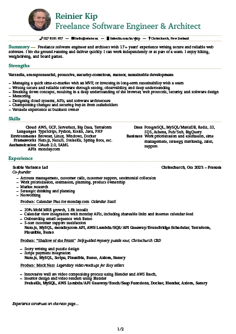

# Resume

[](https://github.com/rjkip/resume/releases/latest/download/Reinier.Kip.Freelance.Software.Engineer.and.Architect.pdf)

## Build

```sh
# Build resume.pdf
sudo apt install texlive texlive-latex-extra texlive-fonts-extra texlive-science latexmk
make

# Clean up after
make clean

# To build as you write
make watch
```
